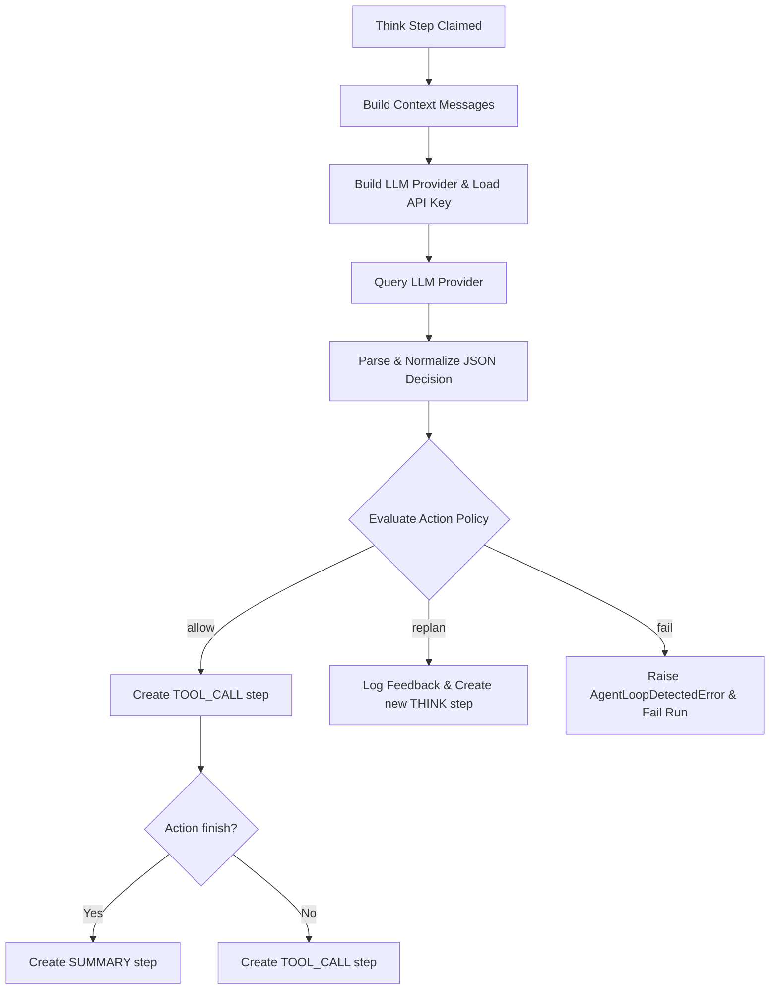

# AI Investigator Thinking Flow

The `think` step is the core reasoning phase of the investigator. During this step, the orchestrator compiles the state of the graph, builds a detailed context, queries the LLM, parses its decision, and filters the proposed action through safety policies.

This document details how the `think` step executes, resolves API configurations, parses LLM decisions, and enforces anti-loop policies.

---

## 1. Step Execution Path (`_execute_think_step`)

When a worker processes an `AgentStepType.THINK` step, it follows this sequence:



---

## 2. API Key Resolution & Provider Selection

1. **Resolve Provider & Model**: The worker reads `run.provider` and `run.model` (configured at startup or inherited from the user's settings).
2. **Fetch API Credentials**: The worker calls `build_llm_provider_for_run()`. It retrieves the credentials from the user's private key store:
   ```python
   service_name = run.config.get("provider_service") or run.provider
   api_key = await ApiKeyStore(session).get_key(run.user_id, service_name)
   ```
   If no API key exists, the worker throws a `RuntimeError`, failing the run.
3. **Instantiate Provider Wrapper**:
   * **OpenAI / compatible**: Sets system instruction and enforces `response_format = {"type": "json_object"}`.
   * **Gemini**: Sends structured conversation text to the REST endpoint `generateContent` with a system instruction and `responseMimeType = "application/json"`.
   * **Anthropic**: Invokes the messages endpoint, formatting system instructions into the system field and conversation history as messages.

---

## 3. Decision Normalization (`LlmDecision`)

LLM responses must conform to the `LlmDecision` Pydantic model. Because models can sometimes structure tool calls differently (e.g. returning keys like `name` or `arguments` instead of `tool_name` or `tool_params`), OGI uses a pre-validation hook (`@model_validator(mode="before")`) to normalize output:

* **Adapts Tool Keys**: Translates keys like `name`, `tool`, or `tool_name` to a single normalized `tool_name` field.
* **Coerces Arguments**: If arguments are returned as a raw JSON string (e.g. `"{\"entity_id\": \"...\"}"`), the validator attempts to parse it into a Python dictionary.
* **Fallbacks**: If no actions are identified, but a `final_summary` is present, it forces the action type to `"finish"`. If no reasoning text is provided, it populates a default string.

---

## 4. Action Policies & Anti-Loop Safeguards (`_check_action_policy`)

Before scheduling a tool call, the orchestrator evaluates the proposed action against historical steps (`prior_steps`). This blocks LLM looping behavior, redundant actions, and unproductive exploration paths:

### 1. Loop and Repeat Execution Checks
* **Transforms**: If the proposed tool is `run_transform` and the exact same transform was already run on the exact same entity in a previous completed step, the policy blocks execution.
* **Generic Tools**: If a tool call has matching arguments and has already been run multiple times (or twice within the last 6 steps), the policy flags a loop.

### 2. Action Policy Decisions
The policy returns an `ActionPolicyDecision` with one of three modes:

* **`allow`**: The tool call is safe. The orchestrator clears temporary loop counters and creates a `tool_call` step in the database.
* **`replan`**: The tool call is rejected, but the run is allowed to continue. The orchestrator:
  1. Increments policy counters: `duplicate_read_replans` (for read-only tools) or `tool_validation_replans` (for validation errors).
  2. Append feedback text to `run.config["policy_feedback"]` (e.g. `"Policy feedback: tool list_entities was already executed..."`).
  3. Completes the current `think` step (saving the feedback).
  4. Inserts a *new* pending `think` step in the DB. This loops back into the orchestrator, forcing the LLM to read the negative feedback and choose a different action.
* **`fail`**: The loop is stubborn and has hit threshold limits. The orchestrator raises `AgentLoopDetectedError` and fails the run.
  * **Thresholds**: 
    * Max duplicate read replans: `3`
    * Max tool validation replans: `3`

### 3. Exhausted Transform Family Policy
* If the proposed transform belongs to a transform family registered in `run.config["exhausted_transform_families"]`, the policy returns `replan` with advice like `"Choose a different transform family, deepen an existing pivot, or finish the investigation"`.
