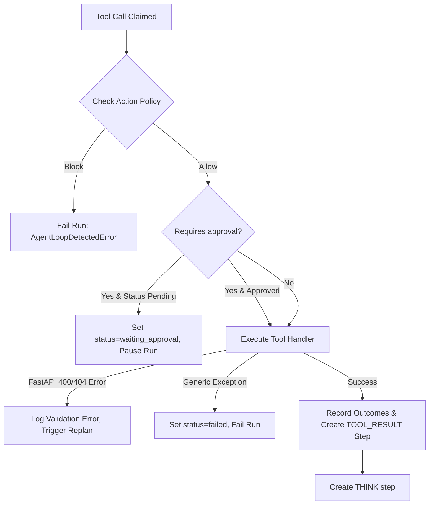

# AI Investigator Tool Registry & Execution

The AI Investigator has a registry of tools to read the graph, execute enrichment transforms, add nodes/edges, and complete the investigation.

This document details the registry structure, individual tool capabilities, approval triggers, validation self-correction, and transform outcome scoring.

---

## 1. Tool Registry Structure

Tools are registered inside `tool_implementations.py` using `ToolDefinition` schemas. Every tool specifies a name, description, JSON Schema arguments, a risk level, and a flag indicating whether user approval is required:

| Tool Name | Risk Level | Requires Approval | Description |
| :--- | :--- | :--- | :--- |
| `list_entities` | low | No | Lists entities in the current project investigation scope. |
| `get_entity` | low | No | Loads a single entity's details (notes, properties, tags). |
| `search_graph` | low | No | fuzzy searches entity values in the project scope. |
| `list_transforms` | low | No | Lists transforms available for a specific entity. |
| `run_transform` | high | **Yes** | Executes a graph transform and merges outputs. |
| `create_entity` | high | **Yes** | Inserts a new node, links it to an existing node, and updates scope. |
| `get_transform_result` | low | No | Loads the result of a previously run transform. |
| `finish_investigation` | low | No | Concludes the investigator loop and submits the final summary. |

---

## 2. Execution Pipeline (`_execute_tool_call_step`)

When the worker claims a `tool_call` step, it follows this execution path:

### 1. Human-in-the-Loop Approvals
If a tool requires approval (risk level = `high`, e.g., `run_transform`, `create_entity`):
1. **Check Status**: If the step status is `RUNNING` (meaning first execution attempt), the orchestrator pauses the run:
   * Sets step status to `waiting_approval`.
   * Clears `worker_id` and `claimed_at` on the step.
   * Sets run status to `paused`.
   * Publishes `agent_approval_requested` to Redis Pub/Sub.
2. **User Decision**: The worker releases the step claim and halts. Once the user posts to `/approve` or `/reject`, the step status is changed to `approved` (or `rejected` which pauses the run).
3. **Execution**: The worker claims the `approved` step, skips the approval check, and runs the handler.

### 2. Validation & Self-Correction (FastAPI 400/404 Catching)
If a tool execution raises a `FastAPI HTTPException` with status codes `400` or `404` (e.g., an LLM queries an entity name that was deleted, or writes a malformed transform configuration):
1. The orchestrator intercepts the error.
2. It constructs a feedback warning:
   `"Policy feedback: {detail}. Use the exact names and entities returned by prior tool results, choose a different valid action, or finish..."`
3. Calls `_replan_after_tool_validation_error()`:
   * Increments the `tool_validation_replans` counter.
   * Appends the message to the step's `llm_output`.
   * Marks the current `tool_call` step as `completed`.
   * Creates a `tool_result` step in the DB containing `success: false` and the error message.
   * Publishes `agent_tool_result` to Redis.
   * Creates a new pending `think` step in the DB.
4. The agent is forced to replan, reading the feedback in its next prompt context, allowing it to self-correct and try an alternative action.

---

## 3. Scopes & Individual Tool Implementations

### 1. Scope Constraints (`_ensure_scope`)
All entity lookups (`get_entity`, `list_transforms`, `run_transform`, `create_entity`) check scope mode constraints:
* If `run.scope.mode == "selected"` and the target entity ID is not present in `run.scope.entity_ids`, the tool raises an HTTP 400 validation error, blocking execution.

### 2. `create_entity` Implementation
The agent can insert new entities to build connections to newly discovered pivots (e.g., extracting an email address or IP from a webpage dump):
1. Inserts the entity into `EntityStore`.
2. If `link_to_entity_id` is specified, it inserts an edge in `EdgeStore` linking the source and target nodes with a label (default `"derived"`).
3. **Scope Extension**: If the run is in `"selected"` scope mode, the newly created entity's UUID is automatically added to `run.scope["entity_ids"]` so that the agent is allowed to query and run transforms on it in future steps.

### 3. Transform Outcome Scoring (`_record_transform_outcome`)
After a transform completes successfully, the orchestrator evaluates its yield:
1. Compares newly generated entities and edges against `run.config["known_entity_ids"]` and `run.config["known_edge_signatures"]` to find new elements.
2. **Productive vs Low-Yield**: A transform is marked as `low_yield` if it returns zero new entities and edges, or at most 1 new entity, 1 new edge, and 1 new type.
3. **Transform Family Exhaustion**:
   * The orchestrator records transform performance in `run.config["transform_memory"]`.
   * If a transform family has run at least 3 times (`EXHAUSTED_FAMILY_MIN_RUNS`) and has been low-yield in 2 of the last 3 runs (`EXHAUSTED_FAMILY_RECENT_LOW_YIELD_THRESHOLD`), it is marked as exhausted in `run.config["exhausted_transform_families"]`.
   * In future steps, if the LLM attempts to choose this transform, the action policy blocks it with feedback, preventing waste of LLM tokens and API budgets.
