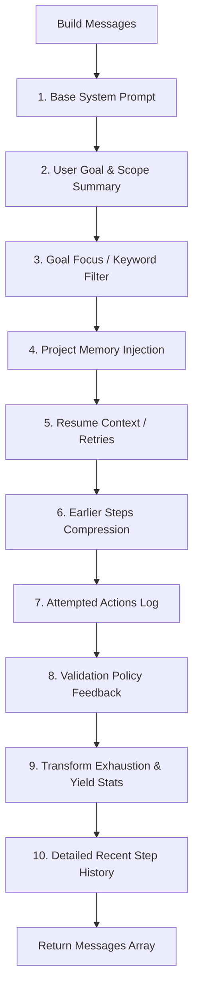

# AI Investigator Context & Prompt Engineering

To ensure the AI Investigator makes accurate decisions, stays within its task boundaries, and self-corrects, OGI uses a structured context assembly process. This is managed by the `AgentContextBuilder` class in `context.py`.

This document details how messages are built, how platform goals are prioritized, and how step histories are compressed.

---

## 1. Context Assembly Flow

The orchestrator calls `build_messages()` before every `think` step. Rather than sending a flat prompt, it builds a structured sequence of messages to the LLM.



---

## 2. Message Blocks

### 1. Base System Prompt
Defines the agent's core role and operational constraints:
* Must use only available tools.
* Reasoning must be concise, factual, and auditable.
* Warns against inventing entities. Entity properties are metadata, not standalone graph entities.

### 2. User Goal & Scope Summary
* **User Goal**: Outputs the raw text of the user's initial prompt (`run.prompt`).
* **Scope Summary**:
  * If scope mode is `"selected"`, lists the specific entity values and types allowed (caps preview count at `25` entities).
  * If scope mode is `"all"`, outputs `"Whole project scope"` and appends a preview list.

### 3. Goal Focus (Target Platform Prioritization)
The context builder uses keyword matching to help the agent maintain focus on target investigation platforms:
* **Platform Keywords**: scans the prompt for matches against: `youtube`, `github`, `reddit`, `twitter`, `x.com`, `instagram`, `tiktok`, `linkedin`, `facebook`, `telegram`, `discord`, `twitch`.
* **Behavior Injection**:
  * If target platform keywords match, it appends f`"Goal focus: the user explicitly asked about {targets}. Prioritize entities and transforms directly related to that target..."`.
  * Instructs the agent not to pivot into unrelated sibling accounts and to prefer summarizing findings once target enrichments are complete.
  * If no keywords match, it appends a general focus instruction: `"Prefer direct enrichment of the requested target over broad lateral pivots. Finish once the goal is sufficiently answered..."`

### 4. Project Memory Injection
If project memory has been generated from preceding runs:
* Injects prior project summaries.
* Appends lists of known facts, recent findings, and exhausted paths.
* Displays a timeline of recent runs.

### 5. Resume Context
If the run is a retry of a failed, cancelled, or completed run:
* Injects metadata of the source run.
* Appends prior error messages.
* Renders snapshots of the final steps of the previous run to prevent restarting the investigation from scratch.

---

## 3. History Compression & Feedback Blocks

To prevent exceeding LLM context window limits on long runs, the context builder splits history into two tiers:

### 1. Older Steps Compression
Steps older than `max_recent_steps` (default 8) are compressed into single-line logs in a summary block:
```
Earlier completed steps summary:
- step 1: think (completed)
- step 2: tool_call (completed)
```

### 2. Detailed Recent Step History
The most recent 8 steps are rendered with full granularity, containing reasoning, tool names, inputs, and output JSON summaries:
```
Recent step history:
- step 11: think [completed] reasoning=I need to resolve this profile URL...
- step 12: tool_call [completed] tool=run_transform output={"success": true, ...}
```

### 3. Attempted Actions Block
To prevent the LLM from making the same tool requests, the builder extracts the last 12 tool calls and lists them as a checklist:
```
Previously attempted actions and outcomes:
- run_transform {'transform_name': 'resolve_twitter_id', 'entity_id': '...'}
Do not repeat the same tool call or rerun the same transform on the same entity unless there is new evidence.
```

### 4. Policy Feedback Block
If the agent triggers validation failures or loop rules:
```
Policy feedback from recent validation:
- Policy feedback: Transform 'resolve_twitter_id' already ran on '...' in this run
Use the already collected results. Do not repeat blocked read-only actions.
```

### 5. Yield & Exhaustion Progress
Shows productivity scores for transforms:
```
Recent transform novelty and exhausted paths:
- resolve_twitter_id on twitter_handle: 0 new entities, 0 new edges [low-yield]
- exhausted transform families: resolve_twitter_id
Avoid low-yield lateral expansion across the same transform family.
```
