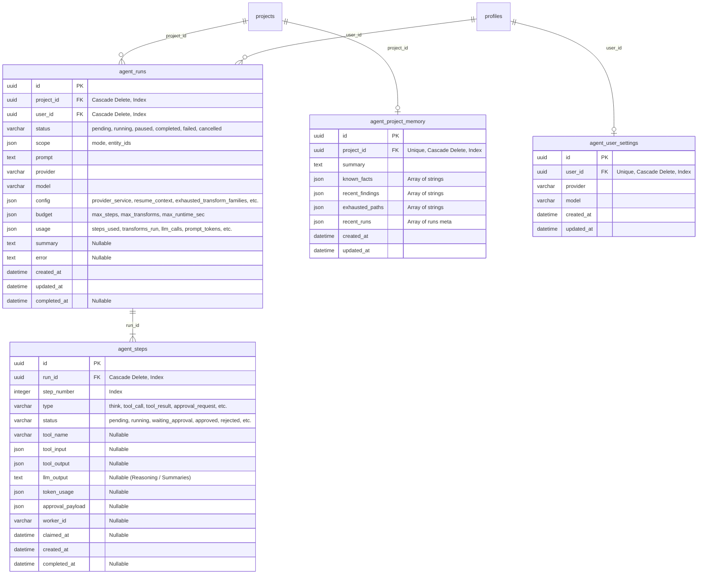

# AI Investigator Database Schema & Models

The AI Investigator relies on three main persistent SQLModel entities: `AgentRun`, `AgentStep`, and `AgentProjectMemory`, along with user preference storage `AgentUserSettings`. 

This document details the tables, schemas, relations, and serialization structures.

---

## 1. Schema Diagrams

---

## 2. Table Details

### 1. `agent_runs` (`AgentRun` Model)
Represents an investigator job initiated by a user. Each run is scoped to a specific project and user context.

* **`status` (`AgentRunStatus` Enum)**:
  * `pending`: Run is created, but no worker has claimed steps yet.
  * `running`: Active execution phase.
  * `paused`: Worker is waiting for user action (e.g. approval or rejection of a tool step).
  * `completed`: Successful termination via `finish_investigation`.
  * `failed`: Execution hit an unrecoverable exception, budget limit, or loop limit.
  * `cancelled`: Manually terminated by the user.
* **`scope` (`ScopeConfig` JSON)**:
  * `mode`: `"all"` (full project graph access) or `"selected"` (worker operations restricted to subset entities).
  * `entity_ids`: List of UUIDs describing the allowed workspace entities when in `"selected"` mode.
* **`budget` (`BudgetConfig` JSON)**:
  * `max_steps`: Total allowed step execution count.
  * `max_transforms`: Max number of graph transforms to invoke.
  * `max_runtime_sec`: Cutoff duration from creation time.
* **`usage` (`UsageInfo` JSON)**:
  * Tracks dynamic counters: `steps_used`, `transforms_run`, `llm_calls`, `prompt_tokens`, `completion_tokens`, along with recovery counts: `duplicate_read_replans` and `tool_validation_replans`.
* **`config` (JSON)**:
  * Stashes transient worker configs: `provider_service` (maps OpenAI/Gemini/Anthropic keys), `resume_context` (stores snapshots of parent runs for retries), `exhausted_transform_families` (list of low-yield transforms to avoid repeating), and `policy_feedback` (validation warnings).

### 2. `agent_steps` (`AgentStep` Model)
Tracks individual atomic actions of the agent runtime. A run consists of multiple sequential steps.

* **`step_number` (Integer)**: Sequential number starting at 1. Ordered inside SQL queries to reconstruct step history.
* **`type` (`AgentStepType` Enum)**:
  * `think`: Worker evaluates context and asks LLM what to do.
  * `tool_call`: Worker prepares to invoke a registry tool.
  * `tool_result`: Output data returned by a registry tool.
  * `approval_request`: User review trigger.
  * `approval_response`: Decided approval state (approved/rejected).
  * `summary`: Successful conclusion text.
  * `error`: Fault details block.
* **`status` (`AgentStepStatus` Enum)**:
  * `pending`: Queued for execution.
  * `running`: Claimed and executing.
  * `waiting_approval`: Paused waiting for user response.
  * `approved` / `rejected`: Approval decisions.
  * `completed`: Execution successful.
  * `failed`: Execution faulted.
* **`worker_id` (String) & `claimed_at` (DateTime)**:
  * Used for concurrency control. A worker writes its hostname/PID to a step to claim exclusive processing rights. Stale claims are recovered if `claimed_at` falls behind settings limits.
* **`approval_payload` (JSON)**:
  * Contains the details shown to the user during approvals, including `tool_name`, `tool_input`, `requires_approval`, and human inputs (`decision`, `note`).

### 3. `agent_project_memory` (`AgentProjectMemory` Model)
A persistent memory system that stores cumulative knowledge about a project across multiple separate investigator runs.
* **`known_facts` (JSON Array)**: Deduplicated statements about completed runs, executed productive transforms, and overall graph updates.
* **`recent_findings` (JSON Array)**: A chronological log of output summaries from all tools.
* **`exhausted_paths` (JSON Array)**: Low-yield paths and validation warnings recorded from preceding runs.
* **`recent_runs` (JSON Array)**: Historical records showing runs prompts, concluding status, and output summaries.

### 4. `agent_user_settings` (`AgentUserSettings` Model)
Stores user-level configurations specifying the default preferred AI provider (e.g. OpenAI) and LLM model name (e.g. GPT-4o-mini).

---

## 3. Serialization and Constraints
* **Cascade Deletes**: Both `agent_runs` and `agent_steps` have CASCADE definitions on their foreign keys (`project_id`, `user_id`, `run_id`). When a project is deleted, all historical agent data is wiped automatically.
* **Native Enums in SQL**: Enums are serialized to VARCHAR values via `SAEnum(..., native_enum=False)` to prevent complex migration issues across SQLite and PostgreSQL targets.
* **JSON Serialization**: SQLite processes SQLModel JSON columns as text strings. The Python repository uses custom SQLAlchemy JSON column types to ensure dictionary payloads parse cleanly into standard lists and dictionary objects on fetch.
