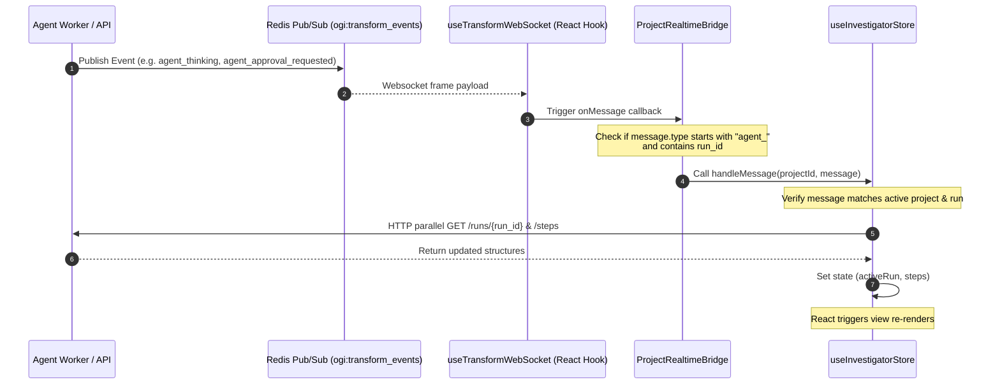

# AI Investigator Frontend Flow & State Sync

The frontend UI for the AI Investigator is built with React 19, TypeScript, and TailwindCSS. It provides a real-time log of investigator steps, displays agent reasoning, lets users approve or reject high-risk tool calls, and handles configuration settings.

This document details the components, the Zustand state store, and the real-time WebSocket syncing pipeline.

---

## 1. UI Components Map

The main workspace panel for the agent is `InvestigatorPanel.tsx`. It is structured into two main view areas: a configuration/prompt panel on the left, and a step sequence log on the right.

```
+-------------------------------------------------------------------------------+
| InvestigatorPanel                                                             |
| +-------------------------------------+ +-----------------------------------+ |
| | Left Column (Controls & Prompt)     | | Right Column (Step Logs)          | |
| |                                     | |                                   | |
| | [InvestigatorControls]              | | [InvestigatorStepLog]             | |
| | - Refresh, Cancel, Retry buttons    | | - step 1: Think [Reasoning]       | |
| | - Settings button (Trigger Dialog)  | | - step 2: Tool Call [Params JSON] | |
| |                                     | | - step 3: Approval Required       | |
| | [InvestigatorPrompt]                | |   [Approve] [Reject] buttons      | |
| | - Text Area Prompt Input            | | - step 4: Summary [Final Report]| |
| | - Scope Select (All / Selected)     | |                                   | |
| | - Start Run Button                  | |                                   | |
| +-------------------------------------+ +-----------------------------------+ |
|                                                                               |
| [AgentSettingsDialog]  --> Opens [ApiKeySettings] if keys are missing         |
+-------------------------------------------------------------------------------+
```

### 1. Panel Components
* **`InvestigatorControls`**:
  * Displays the current overall run status.
  * Provides manual overrides: **Refresh** (calls API list), **Cancel** (posts to `/cancel` endpoint), and **Retry** (clones settings of active run and starts a new one).
  * Contains a gear button opening `AgentSettingsDialog`.
* **`InvestigatorPrompt`**:
  * Captures the user prompt input.
  * Renders a scope selector toggle: `"All project entities"` or `"Selected entities"`. If `"Selected entities"` is selected, displays the count of highlighted canvas nodes (`selectedNodeIds`).
  * Disables input fields when a run is active (`pending`, `running`, or `paused`).
* **`InvestigatorStepLog`**:
  * Renders the chronological list of steps. Routes rendering of bodies based on step properties:
    * If `step.status == "waiting_approval"`, renders `StepApproval` (Approve/Reject actions).
    * If `step.type == "think"`, renders `StepThinking` (formatted markdown reasoning).
    * If `step.type == "tool_call" / "tool_result"`, renders `StepToolCall` (JSON code blocks).
    * If `step.type == "summary"`, renders `StepSummary`.
    * If `step.type == "error"` or `step.status == "failed"`, renders `StepError`.

---

## 2. Zustand State Store (`useInvestigatorStore.ts`)

The Zustand store manages backend HTTP communication and maintains local client-side state:

* **State Variables**:
  * `projectId`: Active workspace project ID.
  * `activeRun`: Current `AgentRun` model payload (or null).
  * `steps`: Chronological array of `AgentStep` logs.
  * `isLoading` / `error`: Loading flags and API warning alerts.
* **Store Actions**:
  * `startRun()`: Sends `POST /start` with prompt and scope configurations, fetches initial steps, and updates state.
  * `loadActiveRun()`: Queries `GET /runs?statuses=pending,running,paused` to find any active runs on the current project. If one exists, fetches its steps and registers it as the current active run.
  * `refreshRun()`: Performs parallel fetches to reload details and step logs:
    ```typescript
    const [run, steps] = await Promise.all([
      api.agent.getRun(projectId, runId),
      api.agent.listSteps(projectId, runId),
    ]);
    ```
  * `cancelRun()` / `retryRun()`: Calls backend termination or cloning routes.
  * `approveStep()` / `rejectStep()`: Posts human-in-the-loop decisions (`decision = "approved" / "rejected"`) along with comments to `/approve` and `/reject` step endpoints.

---

## 3. Real-Time Sync & WebSocket Bridge

To ensure users see step execution, token budgets, and approval queries in real-time, the frontend binds agent events to a global WebSocket handler.



1. **Broadcaster**: When the worker or API updates a step, it publishes an event message to the Redis channel `ogi:transform_events:{project_id}`.
2. **WebSocket Connection**: The frontend hook `useTransformWebSocket` establishes a persistent connection to the backend `/ws/projects/{project_id}` endpoint.
3. **Bridge Handling**: The `ProjectRealtimeBridge` captures incoming messages:
   * Checks message headers: if `message.type.startsWith("agent_")` and `run_id` is present, it forwards the event to `useInvestigatorStore.handleMessage`.
4. **Local Update**: `handleMessage` checks if the event matches the open project. If the active run ID matches (or is in active states), it calls `refreshRun()`.
5. **View Update**: The store triggers React re-renders, displaying updated reasoning text, token usage counters, or showing the approval interface instantly.
