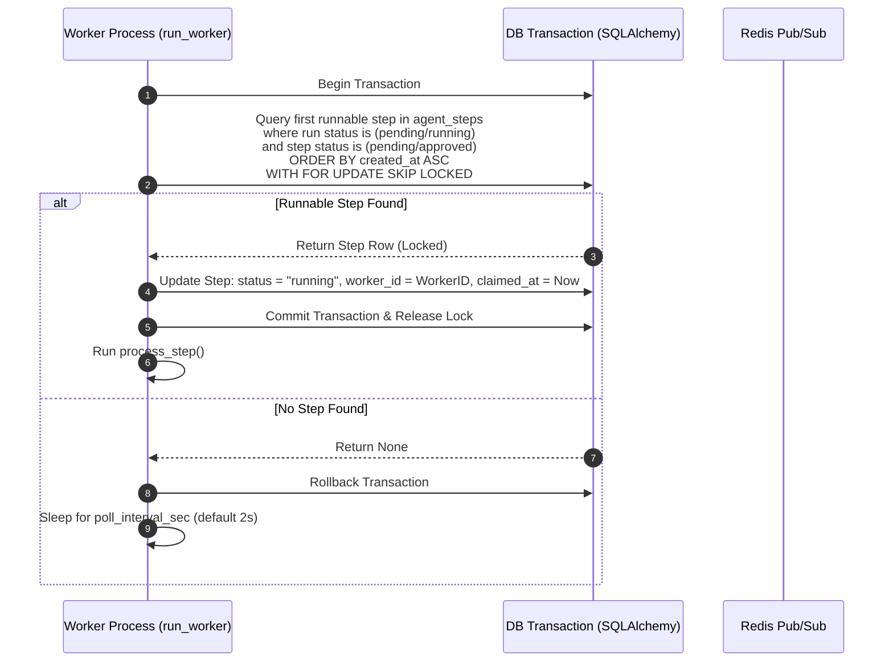
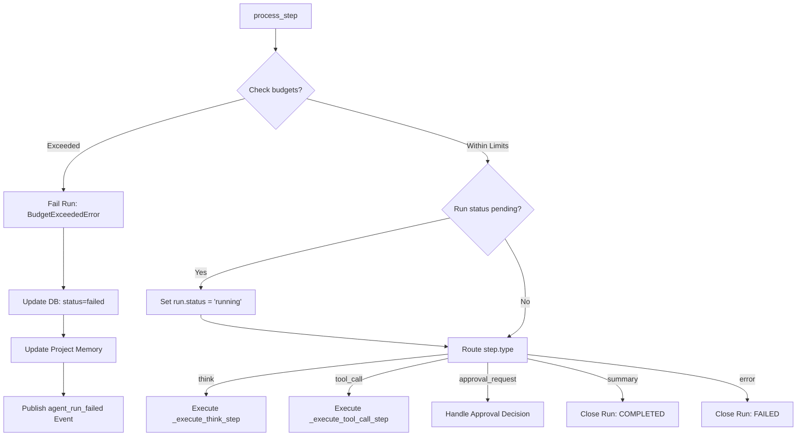

# AI Investigator Worker & Orchestrator Loop

The core execution of the AI Investigator is driven by a background polling daemon. This worker claims runnable steps from the database, executes the orchestration logic, monitors resource limits, evaluates loop policies, and coordinates tool execution.

This document details the worker bootstrap, database lock-claiming mechanisms, stale state recovery, and the primary loop processing states.

---

## 1. Concurrency & Step Claim Flow

When multiple background workers are running (for example, in clustered environments), they must not execute the same investigator step twice. To guarantee concurrency safety without complex distributed lock managers, OGI uses relational row locks with a "skip locked" policy.



---

## 2. Worker Lifecycle

### 1. Bootstrap Phase (`run_worker.py`)
1. **Initialize DB**: Calls `db_module.init_db()` to register engines and session pools.
2. **Discover Transforms**: Instantiates `TransformEngine` and calls `auto_discover()` to scan built-in python transforms. Loads custom plugins from `settings.plugin_dirs`.
3. **Connect to Redis**: Instantiates a connection to Redis (using `settings.redis_url`). If Redis is unavailable, the worker logs a warning and proceeds in degraded mode (meaning visual real-time status updates won't be broadcasted, but database logs will persist normally).
4. **Instantiate Tool Registry**: Builds the default registry with graph actions (`list_entities`, `run_transform`, etc.) referencing engines and execution plugins.
5. **Create Worker ID**: Generates a unique string identifier using the format:
   `{hostname}:{pid}:{uuid4}`
   This ID allows audit logs and active step claims to be traced back to a specific worker instance.
6. **Enter Polling Loop**: Calls the async `poll_orchestrator` loop.

### 2. State Recovery (`recover_stale_state`)
Before entering the loop, the worker runs a cleanup transaction to resolve inconsistencies caused by worker crashes or network timeouts:
1. **Recover Steps**: Searches for steps with status `running` whose `claimed_at` timestamp is older than `settings.agent_claim_timeout_sec` (default 300s). It resets these stale steps back to `pending`, clears `worker_id` and `claimed_at`, allowing other active workers to pick them up.
2. **Recover Runs**: Searches for runs marked as `running` that have no active, pending, or waiting steps left in sequence. If a run has stalled with no remaining runnable path, it is marked as `failed` with the message `"Agent worker stalled and no runnable steps remained"`.

### 3. The Polling Iteration (`run_once`)
The worker executes `run_once()` repeatedly. 
1. Opens a database session.
2. Executes a transaction to claim the next step.
   ```python
   # SQL equivalent of the claim query
   select(AgentStep)
   .join(AgentRun)
   .where(AgentRun.status.in_(["pending", "running"]))
   .where(AgentStep.status.in_(["pending", "approved"]))
   .order_by(AgentStep.created_at.asc(), AgentStep.step_number.asc())
   .limit(1)
   .with_for_update(skip_locked=True)
   ```
3. If no step is returned, the loop sleeps for `settings.agent_worker_poll_interval_sec` (default 2s) before checking again.
4. If a step is successfully claimed, the worker invokes `process_step()`.

---

## 3. Step Processing (`process_step`)

The execution of a claimed step follows this logic:



### 1. Budget Enforcement (`_enforce_budgets`)
Every step checks the execution boundaries defined in the run's `budget` settings. If any budget is exceeded, the worker throws a `BudgetExceededError`, which halts the investigator run:
* **`max_steps`**: Compares `usage["steps_used"]` against limits.
* **`max_runtime_sec`**: Measures elapsed wall-clock time since the run's `created_at` timestamp.
* **`max_transforms`**: Checks `usage["transforms_run"]` against limits (triggered only when executing the `run_transform` tool).

### 2. Execution Routing
If budgets pass, the worker routes execution to specialized sub-handlers based on `step.type`:

* **`AgentStepType.THINK`**:
  * Calls `_execute_think_step()`. Assembles graph context, queries the LLM provider, parses JSON choices, applies action loop policies, and creates either a `tool_call` step or a `summary` step.
* **`AgentStepType.TOOL_CALL`**:
  * Calls `_execute_tool_call_step()`. Verifies approvals, executes the tool against the active DB transaction, logs outcomes, records exhausted transform families, creates a `tool_result` step, and spawns the next `think` step.
* **`AgentStepType.APPROVAL_REQUEST`**:
  * Evaluates human intervention states inside `step.approval_payload["decision"]`.
  * If `"approved"`, completes the approval step and continues.
  * If `"rejected"`, pauses the run (`status = "paused"`) and updates the state.
  * If no decision has been written, it marks the step as `waiting_approval`, clears worker claims, sets the run to `paused`, and publishes `agent_approval_requested` to Redis.
* **`AgentStepType.SUMMARY`**:
  * Concludes the investigation. Sets the step status to `completed`, run status to `completed`, updates project memory files, and fires `agent_run_completed`.
* **`AgentStepType.ERROR`**:
  * Marks the step as `failed` and sets the run status to `failed`, recording error messages.
