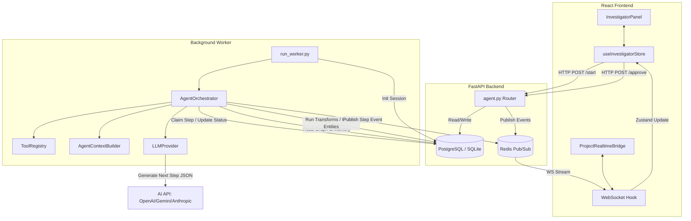

# OGI AI Investigator Architecture & Flow Overview

The OGI **AI Investigator** is a visual link analysis agent designed to automatically explore and enrich entity relationship graphs. It utilizes Large Language Models (LLMs) to dynamically query graph states, make reasoning decisions, select and run built-in or plugin transforms on entities, request human approvals for high-risk actions, and compile structured investigation findings.

This document provides a high-level architectural map of the AI Investigator feature.

---

## 1. Architectural Map

The AI Investigator operates as a distributed system consisting of three main parts:
1. **Frontend (React & Zustand Store)**: Captures user prompts, configures scopes, displays live step logs, and prompts for step approvals.
2. **FastAPI Backend Router (`agent.py`)**: Exposes REST endpoints to start/cancel/retry investigator runs, request settings, fetch memory summaries, and submit approval decisions.
3. **Background Worker (`run_worker.py` & Orchestrator)**: Runs as a standalone async loop, claiming pending tasks, building state contexts, invoking LLM providers, and executing registered graph analysis tools.

---

## 2. Directory Structure

The feature code is distributed across the following key directories:

### Backend Agent Logic (`backend/ogi/agent/`)
* [models.py](file:///d:/dev/ogi/backend/ogi/agent/models.py): Defines data schemas for agent runs, steps, project memory, and configuration limits.
* [settings_models.py](file:///d:/dev/ogi/backend/ogi/agent/settings_models.py) & [settings_store.py](file:///d:/dev/ogi/backend/ogi/agent/settings_store.py): Defines and manages user settings for model and provider preferences.
* [store.py](file:///d:/dev/ogi/backend/ogi/agent/store.py): Handles SQL transactions for claiming next runnable steps, saving runs, and recovering stale tasks.
* [run_worker.py](file:///d:/dev/ogi/backend/ogi/agent/run_worker.py): Entry point to spin up the background agent worker process.
* [orchestrator.py](file:///d:/dev/ogi/backend/ogi/agent/orchestrator.py): Evaluates execution policies, claims steps, runs step loops, handles failures, and fires real-time events.
* [context.py](file:///d:/dev/ogi/backend/ogi/agent/context.py): Assembles contextual messages and prompts for the LLM based on graph scope, history, memory, and validation feedback.
* [llm_provider.py](file:///d:/dev/ogi/backend/ogi/agent/llm_provider.py): Wraps individual LLM providers (Gemini, OpenAI, Anthropic) and standardizes response parsing via Pydantic model validation.
* [tools.py](file:///d:/dev/ogi/backend/ogi/agent/tools.py) & [tool_implementations.py](file:///d:/dev/ogi/backend/ogi/agent/tool_implementations.py): The agent tool execution registry and implementations (e.g., search, transforms, creations).
* [project_memory_store.py](file:///d:/dev/ogi/backend/ogi/agent/project_memory_store.py): Summarizes cumulative knowledge across runs and maintains facts, recent findings, and exhausted paths.

### Frontend Components (`frontend/src/components/investigator/`)
* [InvestigatorPanel.tsx](file:///d:/dev/ogi/frontend/src/components/investigator/InvestigatorPanel.tsx): The primary container that splits controls, prompts, and details on the left, and step logs on the right.
* [InvestigatorControls.tsx](file:///d:/dev/ogi/frontend/src/components/investigator/InvestigatorControls.tsx): Controls run lifecycles (Cancel, Retry, Refresh) and triggers settings dialogs.
* [InvestigatorPrompt.tsx](file:///d:/dev/ogi/frontend/src/components/investigator/InvestigatorPrompt.tsx): Configures target prompts and scope selections (all entities or selected entities).
* [InvestigatorStepLog.tsx](file:///d:/dev/ogi/frontend/src/components/investigator/InvestigatorStepLog.tsx): Loops through and renders step containers based on step types.
* [AgentSettingsDialog.tsx](file:///d:/dev/ogi/frontend/src/components/investigator/AgentSettingsDialog.tsx): Handles provider and model catalogs, tests api configuration connectivity, and links to API Keys configuration.
* [steps/](file:///d:/dev/ogi/frontend/src/components/investigator/steps/): Renderers for specific step types:
  * `StepThinking.tsx` (reasoning text block)
  * `StepToolCall.tsx` (parameter JSON viewer)
  * `StepApproval.tsx` (Approve/Reject buttons)
  * `StepSummary.tsx` (final results report)
  * `StepError.tsx` (red warning detail panels)

---

## 3. High-Level Lifecycle & Message Pipeline

An end-to-end run of the AI Investigator follows this flow:

### 1. Initiation
1. A user enters a prompt (e.g., `"Investigate user accounts linked to scam-website.com"`) and selects a scope (e.g., `"All project entities"` or `"Selected entities"`).
2. The React UI dispatches the `startRun` action to the Zustand `useInvestigatorStore`.
3. The store posts to `POST /projects/{project_id}/agent/start`.
4. The backend API validates that no other run is active on the project, normalizes settings (e.g. fetches the user's provider and model keys), creates an `AgentRun` record (status = `pending`), inserts step #1 of type `think` (status = `pending`), logs the audit event, and publishes an `agent_run_started` message to Redis.

### 2. Processing (The Worker Loop)
1. The `run_worker` process runs an infinite polling loop. It claims the `pending` step using transactional locks (`CLAIMABLE_STEP_STATUSES`).
2. The worker transitions the step and run status to `running`.
3. For a `think` step:
   * Context is built. It queries active entities, previous step history, policy constraints (to block repeating actions), and prior project memory.
   * The context is sent to the selected LLM provider.
   * The LLM returns a structured JSON choice: either a `tool_call` or `finish`.
   * The orchestrator validates the tool choice. If the action policy blocks the tool (e.g. detected duplicate actions or looping), it replans with negative feedback or fails the run.
   * If the tool choice is allowed, the worker creates a new step of type `tool_call` with status `pending`, completes the `think` step, and publishes `agent_thinking` to Redis.

### 3. Execution & Approval
1. The worker claims the newly created `tool_call` step.
2. If the tool is high-risk (e.g., `run_transform` or `create_entity`), the orchestrator checks if approval has been granted.
3. If no approval is present, the orchestrator sets the step to `waiting_approval`, pauses the run to `paused`, and publishes `agent_approval_requested` to Redis.
4. The user sees the waiting approval step in the frontend step log in real-time (streamed via WebSockets) and clicks **Approve** or **Reject**.
5. The frontend sends `POST /approve` or `POST /reject`.
6. The backend updates the step status (e.g. `approved`), unpauses the run, and publishes `agent_approval_resolved` to Redis.
7. The worker claims the `approved` step, resumes execution, executes the tool, logs results, creates a `tool_result` step, and creates the next `think` step.

### 4. Conclusion
1. The LLM decides it has answered the target prompt or has exhausted all productive paths, returning a `finish` decision containing a `final_summary`.
2. The orchestrator creates a `summary` step.
3. The worker processes the `summary` step, updates the run state to `completed`, writes the final summary text to the run database record, updates `AgentProjectMemory` with facts/findings/exhausted paths, and publishes `agent_run_completed` to Redis.
4. The frontend refreshes, showing the final summary, closing the active worker loop controls.
