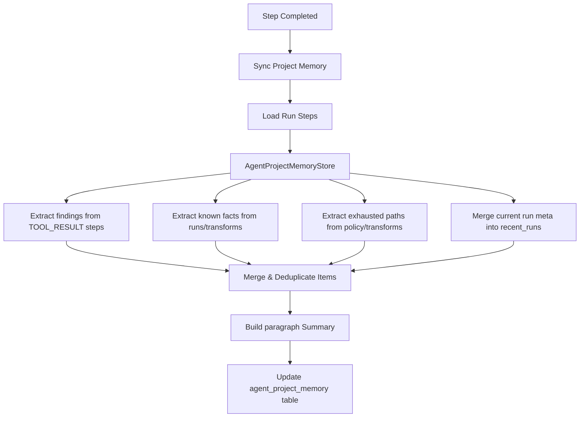

# AI Investigator Project Memory Store

The AI Investigator has a memory system that accumulates facts, findings, and exhausted paths across multiple independent runs on a project. This ensures that subsequent investigator sessions do not duplicate work and are aware of previous successes or dead ends.

This document details the memory schema, sync lifecycle, extraction algorithms, and consolidation logic.

---

## 1. Sync & Update Lifecycle

The project memory is synchronized at the end of every productive step in `AgentOrchestrator`:
* During step execution, when a step completes (`_execute_claimed_step()`), the orchestrator triggers:
  ```python
  await self._sync_project_memory(session, run)
  ```
* This fetches all sequential steps for the run, calls `AgentProjectMemoryStore.update_from_run(run, steps)`, and updates the database row.



---

## 2. Extraction & Deduplication Algorithms

The memory store compiles lists of statements using specialized parser methods:

### 1. Recent Findings Extraction (`_extract_recent_findings`)
* Scans all run steps for type `TOOL_RESULT`.
* Grabs the summary text (`tool_output["summary"]`) and prefixes it with the tool name:
  `"{tool_name}: {summary}"`
* Limits retention to `12` (`MAX_RECENT_FINDINGS`).

### 2. Known Facts Extraction (`_extract_known_facts`)
* Captures overall accomplishments:
  * If the run is completed and has a summary, adds: `"Run '{prompt}' concluded: {run.summary}"`.
  * Grabs transform memory items from `run.config["transform_memory"]` and builds statements:
    `"{transform_name} on {target}: {new_entity_count} new entities, {new_edge_count} new edges"`.
  * Grabs summaries from recent productive tools (`run_transform`, `create_entity`, `finish_investigation`).
* Limits retention to `20` (`MAX_KNOWN_FACTS`).

### 3. Exhausted Paths Extraction (`_extract_exhausted_paths`)
* Extracts blockers and low-yield paths:
  * Grabs names from `run.config["exhausted_transform_families"]` and adds: `"Transform family exhausted: {name}"`.
  * Scans `run.config["policy_feedback"]` for occurrences containing words `"low-yield"` or `"already executed"`.
* Limits retention to `12` (`MAX_EXHAUSTED_PATHS`).

### 4. Recent Runs Merge (`_merge_recent_runs`)
* Keeps a chronological record of runs:
  ```json
  {
    "run_id": "UUID",
    "prompt": "prompt text",
    "status": "completed / failed",
    "summary": "summary text or error text",
    "updated_at": "ISO DateTime string"
  }
  ```
* Deduplicates by matching `run_id`.
* Limits retention to `8` (`MAX_RECENT_RUNS`).

### 5. Deduplication Protocol (`_merge_unique`)
To prevent memory blocks from growing or containing redundant lines, the store normalizes and filters items:
1. Normalizes line spacing and strips outer whitespace.
2. Checks item existence against a `seen` set.
3. Appends unique items and returns the last $N$ entries, ensuring memory stays within token-budget envelopes.

---

## 3. Summary Consolidation (`_build_summary`)

The final text summary is compiled into a single readable paragraph stored in `AgentProjectMemory.summary`. This summary acts as the entry block in future prompt contexts:
* Starts with: `"Project memory tracks {count} recent AI Investigator runs."`
* If the latest run is completed, appends: `"Latest completed run: {run.summary}"`. If it failed, appends: `"Latest run error: {run.error}"`.
* Merges the latest 3 known facts separated by `" | "`.
* Merges the latest 2 exhausted paths separated by `" | "`.

Example consolidated paragraph:
> *"Project memory tracks 3 recent AI Investigator runs. Latest completed run: Identified 2 active accounts linked to scam-website.com. Known facts: resolve_twitter_id on scam_user: 2 new entities, 1 new edges | resolve_github_id on dev_handle: 0 new entities, 0 new edges | create_entity on scam-website.com: Created or reused entity scam-website.com. Exhausted paths: Transform family exhausted: resolve_github_id | Policy feedback: Transform 'resolve_github_id' already ran on 'dev_handle' in this run."*
