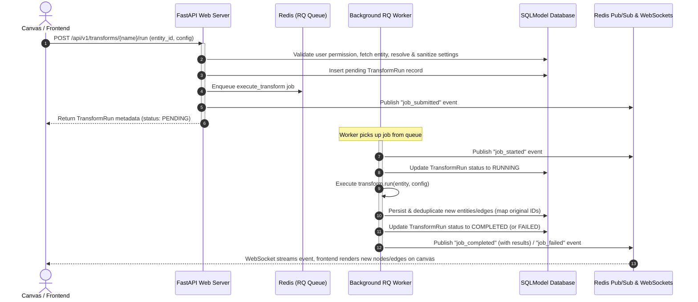

# OGI Transform Feature Implementation: Deep-Dive Analysis

This document provides a comprehensive architectural and code-level walkthrough of how the OpenGraph Intel (OGI) framework implements the **Transform** feature. 

---

## 1. High-Level Architecture & Flow

A **Transform** in OGI is an enrichment task that accepts an input entity (such as a Domain, IP Address, or Person) and produces new entities and edges (relationships) to enrich the graph.

The system uses an asynchronous execution model based on **FastAPI**, **Redis (Python-RQ)**, and **WebSockets** to execute potentially slow OSINT scripts in the background without blocking the web server.

### Execution Flow Diagram



---

## 2. Base Classes & Definition

All transforms must inherit from `BaseTransform`, located in [base.py](file:///d:/dev/ogi/backend/ogi/transforms/base.py).

### Core Components of `BaseTransform`
- **Class Attributes**:
  - `name`: Unique machine-readable identifier (e.g., `"whois_lookup"`).
  - `display_name`: Human-readable name shown in the UI.
  - `description`: Explains what the transform does.
  - `input_types`: A list of compatible `EntityType`s (e.g., `[EntityType.DOMAIN]`).
  - `output_types`: A list of `EntityType`s that the transform can output.
  - `category`: Category grouping for UI organization (e.g., `"DNS"`, `"Web"`, `"Social"`).
  - `settings`: A list of `TransformSetting` objects defining the parameters required/supported.
- **Abstract Method**:
  - `async def run(self, entity: Entity, config: TransformConfig) -> TransformResult`: This is the execution entry point where the actual API requests, DNS lookups, or web scrapes happen.
- **Validation Methods**:
  - `can_run_on(entity)`: Simple check returning if the input entity's type matches `input_types`.
  - Settings parsing helper class methods: `parse_int_setting` and `parse_float_setting` which enforce minimums/maximums and apply configuration overrides.

---

## 3. Registration & Loading

Transforms are divided into **built-in** and **plugin** transforms, managed by the [TransformEngine](file:///d:/dev/ogi/backend/ogi/engine/transform_engine.py).

### Built-in Transforms
Built-in transforms are located in [backend/ogi/transforms/](file:///d:/dev/ogi/backend/ogi/transforms/). They are registered synchronously in the `TransformEngine` during initialization via `auto_discover()`:
```python
def auto_discover(self) -> None:
    # Imports all built-in transforms...
    for cls in [DomainToIP, DomainToMX, ...]:
        self.register(cls())
```

### Plugin Transforms
Plugins are directory-based modules loaded from configurable paths (defaulting to `plugins/`) using the [PluginEngine](file:///d:/dev/ogi/backend/ogi/engine/plugin_engine.py).
1. **Discovery**: `PluginEngine` scans each plugin directory for a subfolder containing a `plugin.yaml` (or `plugin.yml`) manifest.
2. **Metadata Parsing**: The manifest is parsed into a `PluginInfo` object containing details such as enabled status, tags, and license.
3. **Module Importation**: If enabled, the engine adds the plugin path to `sys.path`, and dynamically imports all Python files (excluding files starting with `_`) under the plugin's `transforms/` subdirectory:
   ```python
   spec = importlib.util.spec_from_file_location(module_name, str(py_file))
   module = importlib.util.module_from_spec(spec)
   spec.loader.exec_module(module)
   ```
4. **Instantiation**: It inspects the classes in the imported module using `inspect.getmembers(module, inspect.isclass)` and registers any subclass of `BaseTransform` into the `TransformEngine`.

---

## 4. Execution Lifecycle

Transform execution is managed by the [TransformExecutionService](file:///d:/dev/ogi/backend/ogi/engine/transform_execution_service.py). It has two main entry points: `execute_enqueued` (used in production for async execution) and `execute_direct` (used for synchronous runs/tests).

### Step 1: Validation and Preparation (`validate_and_prepare`)
Before starting any transform, the service verifies security and settings:
1. **Role Enforcement**: Ensures the requesting user is an `owner` or `editor` of the project.
2. **Entity Check**: Ensures the entity exists and belongs to the specified project.
3. **Transform Availability**: Looks up the transform by name in the `TransformEngine`.
4. **User Preference**: Validates if the user has enabled the corresponding plugin (`UserPluginPreferenceStore`).
5. **Type Compatibility**: Checks if the transform can run on the target entity.
6. **Setting Resolution**: Calls `resolve_transform_settings` which merges:
   - The default settings declared on the transform class.
   - Global admin overrides (`TransformSettingsStore.get_global`).
   - User custom overrides (`TransformSettingsStore.get_user`).
   - Runtime request overrides (`config_overrides`).
7. **Sanitization**: Checks setting types (`integer`, `number`, `boolean`, `select`, `string`, `secret`) and validates minimums, maximums, and pattern regexes.
8. **Stored API Key Injection**: If a required setting ends with `_api_key` and is not provided in the config, the service retrieves it from the secure database `ApiKeyStore`. It enforces:
   - Global allow/block lists (`settings.api_key_service_allowlist` / `blocklist`).
   - Plugin verification tiers (restricting community plugins from injecting keys unless configured).
9. **Billing Limits**: Enforces any active billing limits or rate limits using `enforce_transform_run_policy`.

### Step 2: Enqueuing the Job (`execute_enqueued`)
Once prepared, the service:
1. Inserts a `TransformRun` record into the database with `TransformStatus.PENDING`.
2. Logs an audit trail event if an API key was injected.
3. Enqueues the worker job using **python-rq**:
   ```python
   queue.enqueue(
       execute_transform,
       str(run.id),
       prepared.transform_name,
       prepared.entity.model_dump(mode="json"),
       str(prepared.project_id),
       prepared.config_payload.model_dump(mode="json"),
       job_id=str(run.id),
       job_timeout=settings.transform_timeout,
   )
   ```
4. Publishes a `job_submitted` message to the Redis Pub/Sub channel.

---

## 5. Worker Processing & Database Sync

The background worker executes the RQ job via `execute_transform` in [transform_job.py](file:///d:/dev/ogi/backend/ogi/worker/transform_job.py).

Because RQ workers run in isolated processes, the worker initializes its own database connections and local `TransformEngine`/`PluginEngine` instance.

### Task Execution
1. **Status Update**: Publishes `job_started` to Redis and updates the database record status to `RUNNING`.
2. **Execution**: Invokes the transform's `run(...)` method inside the event loop.
3. **Persisting Entities**:
   - The transform returns a `TransformResult` containing new entities and edges.
   - For each entity in `result.entities`, the worker calls `EntityStore.save(project_id, entity)`.
   - `EntityStore` validates the entity and returns the saved DB record. If the entity already exists, it is merged.
   - The worker records an `id_map: dict[UUID, UUID]` mapping the temporary/local entity IDs used in the transform code to the final saved Database IDs.
4. **Persisting Edges**:
   - For each edge in `result.edges`, the worker translates the source/target IDs using the `id_map`:
     ```python
     actual_source = id_map.get(new_edge.source_id, new_edge.source_id)
     actual_target = id_map.get(new_edge.target_id, new_edge.target_id)
     ```
   - It attempts to insert the edge via `EdgeStore.create()`. If an identical edge already exists, the database constraint raises an exception, which is caught and skipped to prevent duplicates.
5. **Remapping Results**: Modifies the output entity and edge lists to use the mapped database IDs, allowing the frontend to reference existing database nodes.
6. **Completion**: Updates the database `TransformRun` status to `COMPLETED` (or `FAILED` with an error message) and publishes a `job_completed` / `job_failed` event to Redis Pub/Sub.

---

## 6. Real-time Event Streaming (WebSockets)

Real-time updates are mediated by Redis and FastAPI WebSockets in [websocket.py](file:///d:/dev/ogi/backend/ogi/api/websocket.py).

1. **Redis Listener**: A singleton FastAPI background task (`redis_pubsub_listener()`) subscribes to the channel pattern `ogi:transform_events:*` on Redis.
2. **WebSocket connection**: The client connects to `ws://host/api/v1/ws/transforms/{project_id}?token={token}`.
3. **Broadcasting**: When `redis_pubsub_listener` receives an event on `ogi:transform_events:<project_id>`, it routes the message to the active WebSockets belonging to that project.
4. **Graph Rendering**: The frontend hook [useTransformWebSocket.ts](file:///d:/dev/ogi/frontend/src/hooks/useTransformWebSocket.ts) handles incoming events. When a `job_completed` event arrives, the frontend merges the newly returned entities and edges into the Sigma.js/Graphology visualization canvas.

---

## 7. Stored API Key Injection & Sandboxing

### Stored API Key Injection
Settings that contain secrets or require keys (e.g. `whoisxml_api_key`) are managed securely. OGI protects them in three ways:
1. **Stripping Settings**: Stored keys are stripped from the configuration payloads returned by the settings endpoints to prevent exposure to unauthorized users.
2. **Verification Tiers**: Users can enable/disable plugins, and OGI restricts stored key usage based on the plugin's verified tier.
3. **API Key Injection Policies**: The global settings variables `api_key_service_allowlist` and `api_key_service_blocklist` control which external APIs are allowed to receive stored keys.

### Transform Sandboxing (`SandboxRunner`)
For untrusted environments (e.g., Cloud Mode), OGI includes [sandbox_runner.py](file:///d:/dev/ogi/backend/ogi/engine/sandbox_runner.py), which uses a Docker container to execute transforms.
- **Docker Isolation**: Spawns a container using `python:3.14-slim`.
- **Resource Constraints**: Limits RAM (`--memory=256m`) and CPU cores (`--cpus=1`).
- **File System Restrictions**: Mounts the filesystem as read-only (`--read-only`), providing only a small temporary write directory (`--tmpfs=/tmp:size=32m`).
- **Network Restrictions**: Disables network access if the plugin doesn't request the network permission (`--network=none`).
- *Note*: While fully implemented, `SandboxRunner` is currently set up as a helper class and is not active in the default local worker execution pipeline.
